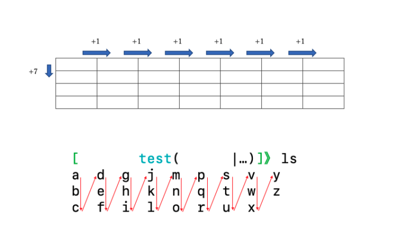

# minils

## Overview
list directory contents
Inspired by ls command G F options with macOS 12.4 zsh

## Notice
This is training project.
So do not respect command options and multibyte characters for simple logic.

### Architecture
- Deno
- TypeScript
- Docker
- Docker Compose
- Makefile

### Implementation
- Get file and directory names from directory entries
- Not output dot files
- Enter directory path as first argument of command
- If there is no input in the first argument of the command, enter the current directory
- If not exist file or directory, print error message to file descriptor 2
- Output file name color in default color
- Output directory names in cyan
- Output "/" at the end of the directory name (default color)
- Calculate the maximum number of characters in a file name with two spaces added or a directory name with a trailing "/" with a space added(Hereinafter, this number of strings is referred to as `<maximum name size>`)
- Output spaces at the end of each listing element, the `<maximum name size>` minus the number of characters in the file name or directory name with a "/" at the end
- Calculate the maximum number of columns using the terminal window size and the `<maximum name size>`
- Calculate the maximum number of lines using files excluding dot files, the number of directories and the maximum number of columns.
- Sort Alphabetically
- Print columns to maximum number of rows
- If the maximum number of rows in a column is exceeded, output to the next column

License
Copyright (c) 2022 Iovesophy. This software is released under the MIT License, see LICENSE. https://opensource.org/licenses/mit-license.php

